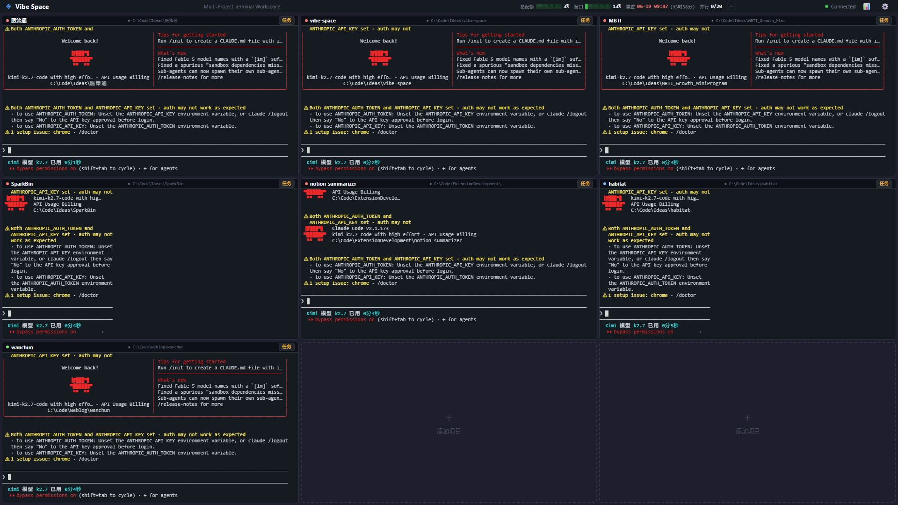

# Vibe Space

> Multi-Agent Task Queue for Claude Code — manage multiple AI coding sessions in one workspace.

Vibe Space turns Claude Code (and other AI CLI agents) into a **multi-project command center**. Instead of juggling terminal windows, you get a single dashboard where you can queue tasks, dispatch them to parallel AI sessions, and monitor every agent's status at a glance.



## Why Vibe Space?

AI coding agents like Claude Code are incredibly powerful, but they are **single-session tools**. If you maintain multiple projects, you end up with a mess of terminal tabs and constant context switching.

Vibe Space solves this with three core ideas:

1. **Project Grid** — See all your projects in one window, each running its own AI agent.
2. **Task Queue** — Write tasks once, queue them up, and let Vibe Space dispatch them automatically when an agent becomes idle.
3. **Status Awareness** — Know whether each agent is idle, busy, or waiting for your approval without switching windows.

## Features

- 🔲 **Multi-project terminal grid** — one pane per project, powered by `node-pty` + `xterm.js`
- 📝 **Task queue per project** — add, reorder, and run tasks sequentially or in bulk
- 🚀 **Auto-dispatch** — Vibe Space watches agent status and sends the next task automatically
- 🖼️ **Attachment support** — attach images, logs, or code files to tasks
- 🧠 **3-layer status detection** — official session files + hooks + terminal scraping
- 💰 **Cost tracking** — see token usage and estimated cost per task *(in progress)*
- 🌐 **Web-based UI** — runs in your browser; can be installed as a PWA
- ⚡ **One-command start** — `vibe-space` launches the server and opens the workspace

## Installation

Requires [Node.js](https://nodejs.org/) 18 or later.

```bash
npm install -g vibe-space
```

Or try it without installing:

```bash
npx vibe-space
```

## Quick Start

1. Make sure [Claude Code](https://github.com/anthropics/claude-code) is installed and authenticated:
   ```bash
   npm install -g @anthropic-ai/claude-code
   claude login
   ```

2. Start Vibe Space:
   ```bash
   vibe-space
   ```

3. Open `http://localhost:9988` in your browser, add your projects, and start queuing tasks.

## Usage

### Adding Projects

On first launch, Vibe Space shows the setup page. Add each project you want to work on:

- Project name
- Working directory
- AI agent command (default: `claude`)

### Creating Tasks

In the workspace, click the task button on any project pane to open the task panel. You can:

- Type a task and click **Add Task**
- Attach images or files
- Use task templates
- Import tasks from a text list or JSON file

### Running Tasks

Click **Run All** to start the queue. Vibe Space will:

1. Start the AI agent in the project directory
2. Send the first task
3. Wait for the agent to finish
4. Validate the output
5. Move to the next task automatically

## CLI Options

```bash
vibe-space [options]

Options:
  --port=<n>      Port to run the server on (default: 9988)
  --config=<path> Path to a custom config file
  --no-open       Do not open the browser automatically
  --help, -h      Show help
  --version, -v   Show version
```

## Architecture

```
┌─────────────────────────────────────┐
│           Browser / PWA             │
│   (React-free vanilla JS + xterm)   │
└─────────────┬───────────────────────┘
              │ WebSocket / HTTP
┌─────────────▼───────────────────────┐
│     Vibe Space Server (Node.js)     │
│  Express + WebSocket + node-pty     │
└─────────────┬───────────────────────┘
              │ spawns
┌─────────────▼───────────────────────┐
│   Claude Code / Codex / aider ...   │
│        one per project pane         │
└─────────────────────────────────────┘
```

## Configuration

Vibe Space stores configuration in `config.json` in the project root. A template is provided in [`config.example.json`](./config.example.json).

You can customize:

- Grid layout (rows × cols)
- AI provider and API key
- Startup command per project
- Theme colors
- Loop settings (silence threshold, auto-pass delay)
- Task templates

## Development

```bash
git clone https://github.com/yaolinhui/vibe-space.git
cd vibe-space
npm install
npm run dev
```

## Roadmap

- [x] Multi-project terminal grid
- [x] Task queue with auto-dispatch
- [x] Attachment support
- [x] 3-layer status detection
- [x] PWA / installable app mode
- [ ] Cost tracking per task
- [ ] Task templates & bulk import
- [ ] Multi-provider support (Codex, aider, Gemini CLI)
- [ ] Session history & resume
- [ ] Tauri desktop build

## Contributing

Contributions are welcome! Please open an issue or pull request.

## License

[MIT](./LICENSE)
